  

hi, i'm mohammed. currently:

engineering @ UWO, HBA @ Ivey Business School - dropped out as of 2026/08/02

alpine guide - (eiger, mt alberta, logan, rainer)
training for alpamayo.

founder of world1 
world1 bets on early-stage founders in hard technical sectors and gets them to revenue

im also building evaluation environments for long-horizon rl evaluation, as well as neural-interface sessions that make intent measurable under changing neural, cognitive, and contextual state. see aporia, anemoia01 
